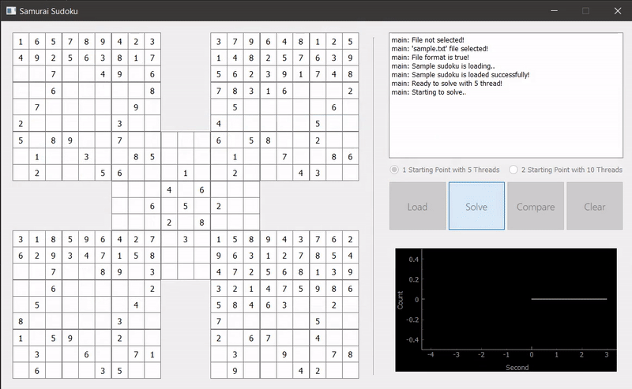

# Samurai Sudoku App

Samurai Sudoku App with multithread using PyQt5, pyqtgraph for KOU YAZLAB project.



## Installation and Usage

Run the following code in order

```bash
git clone https://github.com/birhann/samurai-sudoku.git
```
```bash
pip install -r requirements.txt
```
```bash
py main.py
```